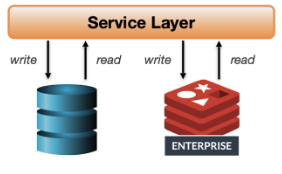
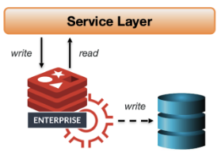
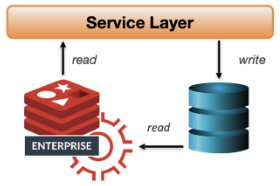
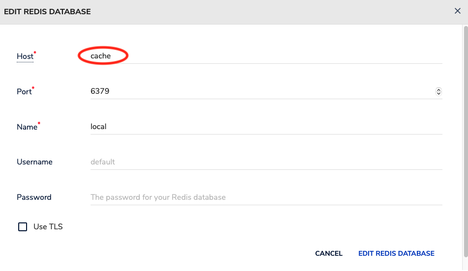
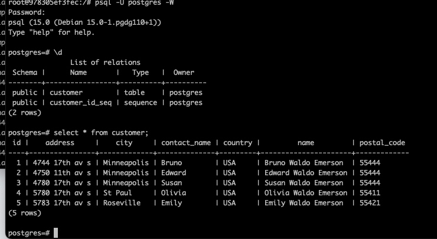
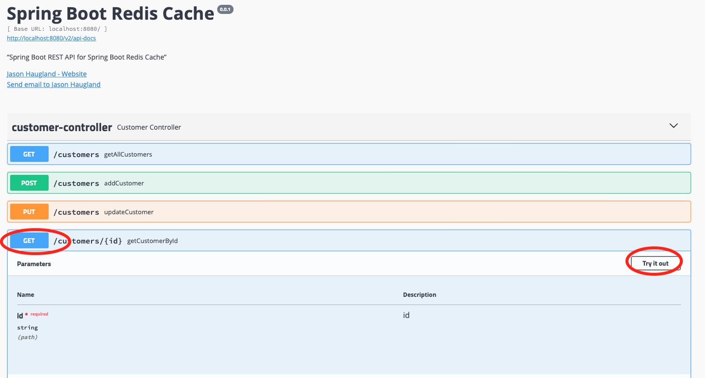
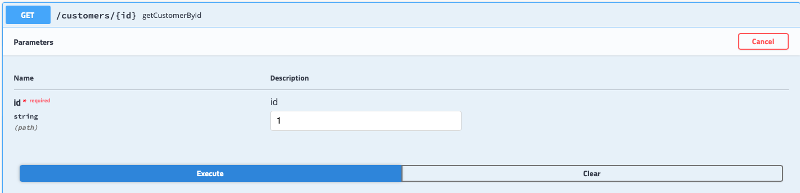
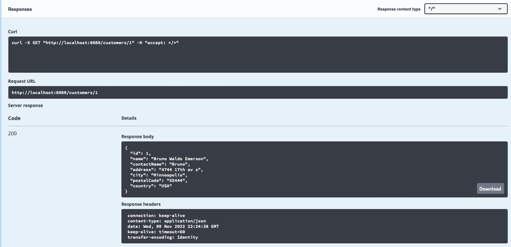
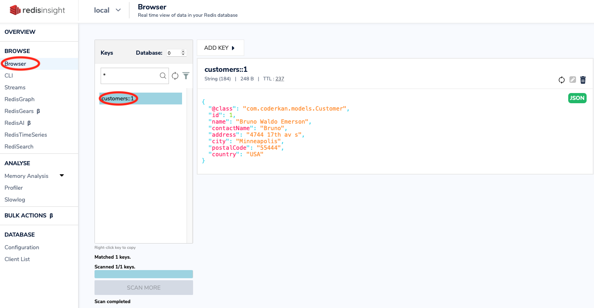

# Spring Boot Redis Cache
This demonstrates spring boot redis cache.  The main directory caches postgresql and the subdirectory *cassandra* similarily caches cassandra.

Outline:

  - [**Getting Started**](#getting-started)
  - [**Cachin Patterns**](#caching-patterns)
    - [Cache-Aside](#cache-aside)
    - [Write-Through and Write-Behind](#write-behind-and-write-through)
    - [Read-Through](#read-through) 
  - [**Maven Dependencies**](#maven-dependencies)
  - [**Redis Configuration**](#redis-configuration)
  - [**Spring Service**](#spring-service)
  - [**Docker & Docker Compose**](#docker--docker-compose)
  - [**PostgreSQL**](#access-postgresql)
  - [**Use Redisinsight**](#use-redisinsight)
  - [**Build & Run Application**](#build--run-application)
  - [**Endpoints with Swagger**](#endpoints-with-swagger)
  - [**Proof of caching**](#proof-point-for-the-caching)
  - [**Verify cached in redis**](#verify-the-data-is-now-cached-in-redis)
  - [**Demo**](#demo)

Links:

  - [**Spring Boot Cache Abstraction**](https://docs.spring.io/spring-framework/docs/3.2.x/spring-framework-reference/html/cache.html)
  - [**Stackoverflow Null Pointer Fix**](https://stackoverflow.com/questions/33083206/cacheevict-with-key-id-throws-nullpointerexception)
  - [**Baeldung Spring Boot Cache with Redis**](https://www.baeldung.com/spring-boot-redis-cache)
  - [**Spring Boot and Redis-SpEL/Caching**](https://ozymaxx.github.io/blog/2020/05/11/redis-springboot-2-en/)
  - [**Spring Caching with Redis**](https://medium.com/javarevisited/spring-caching-with-redis-dc1e3bdcc552)
  - [**Redis Stack**](https://redis.io/docs/stack/)
  - [**Redisinsight**](https://redis.com/redis-enterprise/redis-insight/)
  - [**OpenAPI 3**](https://springdoc.org/v2/)
  - [**Using Redisinsights**](https://docs.redis.com/latest/ri/using-redisinsight/)
  - [**Spring Data for Cassandra**](https://docs.spring.io/spring-data/cassandra/docs/current/reference/html/#cassandra.core)
  - [**Bitnama docker container**](https://hub.docker.com/r/bitnami/cassandra/)
  - [**Bitnam Cassandra datacenter**](https://github.com/bitnami/charts/issues/4408)
  - [**Initialize cassandra keyspace and data**](https://gist.github.com/derlin/0d4c98f7787140805793d6268dae8440)
  - [**Spring data cassandra setup**](https://stackoverflow.com/questions/64622251/not-able-to-connect-to-cassandra-from-spring-boot-aplication-using-spring-boot-s)
  - [**Spring cassandra authentication**](https://stackoverflow.com/questions/64910934/cassandra-authentication-issue-after-upgrading-to-spring-boot-2-3-5-release)
  - [**Spring cassandra CRUD example**](https://www.bezkoder.com/spring-boot-cassandra-crud/)

## Getting Started

In this project, Redis is used for caching with Spring Boot.  There are multiple docker containers:  postgres, redis, 
redisinsight, and the spring boot application.  The subdirectory *cassandra* uses a cassandra container instead of postgres
When you send any request to get all customers or customer by id, you will wait 3 milliseconds if Redis has no related data.
A variety of cluster patterns and behaviours can be acheived through this spring cache technique.   So, write behind, write through, read through and cache aside are all possible using the spring cache.

## Caching Patterns
Using spring boot caching, multiple caching patterns can be successfully used.  
Code changes to achieve each pattern can be made in [CustomerServiceImpl.java](src/main/java/com/coderkan/services/impl/CustomerServiceImpl.java)

### Cache-Aside

* The application first checks if the data is available in the cache
* If the data is not present in the cache
  * application retrieves the data from the primary data store
  * application updates the cache 
  * application returns the data to the caller.

### Write-Behind and Write-Through

#### Write-Through
* Ensures that the cache is always up-to-date by updating the cache whenever the primary data store is updated.
* application writes data to both the cache and the primary data store
* ensures cache always contains the latest data, minimizing the chances of stale data.

#### Write-Behind
* Is an optimization of the write-through pattern.
* Application writes data to the cache and asynchronously updates the primary data store
* improves the application's write performance-no need to wait for primary data store to acknowledge the write operation.
* this could be improved by writing to a redis stream
  * redis stream consumer spring java job would make write to primary data store

### Read-Through

* cache code is responsible for fetching the data from primary data store when cache miss occurs
* Simplifies application code, application only interacts with the cache 
* No need to handle cache misses explicitly in application logic

## Maven Dependencies

I changed this from lettuce to jedis
```xml
<dependency>
	<groupId>org.springframework.boot</groupId>
	<artifactId>spring-boot-starter-data-redis</artifactId>
</dependency>
<dependency>
        <groupId>redis.clients</groupId>
        <artifactId>jedis</artifactId>
        <version>${version.jedis}</version>
</dependency>

```

## Redis Configuration

```java
@Configuration
@AutoConfigureAfter(RedisAutoConfiguration.class)
@Slf4j
@EnableCaching
public class RedisConfig {


  @Value("${spring.redis.host}")
  private String redisHost;

  @Value("${spring.redis.port}")
  private int redisPort;

  @Value("${spring.cache.redis.time-to-live}")
  private int cacheTtl;

  @Value("${spring.cache.redis.cache-null-values}")
  private boolean cacheNull;


  @Bean
  public RedisTemplate<String, Serializable> redisCacheTemplate(LettuceConnectionFactory redisConnectionFactory) {
    RedisTemplate<String, Serializable> template = new RedisTemplate<>();
    template.setKeySerializer(new StringRedisSerializer());
    template.setValueSerializer(new GenericJackson2JsonRedisSerializer());
    template.setConnectionFactory(redisConnectionFactory);
    log.info("redis host " + redisHost);
    log.info("redis port " + String.valueOf(redisPort));
    return template;
  }

  @Bean
  public CacheManager cacheManager(RedisConnectionFactory factory) {
    RedisCacheConfiguration config = RedisCacheConfiguration.defaultCacheConfig();
    RedisCacheConfiguration redisCacheConfiguration = config
            .entryTtl(Duration.ofMinutes(cacheTtl))
            .serializeKeysWith(
                    RedisSerializationContext.SerializationPair.fromSerializer(new StringRedisSerializer()))
            .serializeValuesWith(RedisSerializationContext.SerializationPair
                    .fromSerializer(new GenericJackson2JsonRedisSerializer()));
    if (cacheNull) {
      redisCacheConfiguration.getAllowCacheNullValues();
    } else {
      redisCacheConfiguration.disableCachingNullValues();
    }
    RedisCacheManager redisCacheManager = RedisCacheManager.builder(factory).cacheDefaults(redisCacheConfiguration)
            .build();
    return redisCacheManager;
  }
}
```


## Spring Service

Spring Boot Customer Service Implementation will be like below class.
I used Spring Boot Cache @Annotations for caching.

These are:

* `@Cacheable`
* `@CacheEvict`
* `@Caching`
* `@CachceConfig`
	
Updated this code on the CacheEvict as it did not work. [Stackoverflow link](https://stackoverflow.com/questions/33083206/cacheevict-with-key-id-throws-nullpointerexception)
Next, I changed this to do a cacheput on add so behaves like [write-through](#write-through)
```java
        @Cacheable
	@Override
	public List<Customer> getAll() {
		waitSomeTime();
		return this.customerRepository.findAll();
	}

	// @CacheEvict(key = "#id", condition = "#id!=null")
	//  Switching to a CachePut from a CacheEvict
	@CachePut(key = "#customer.id")
	@Override
	public Customer add(Customer customer) {
		log.info(" write to database");
		return this.customerRepository.save(customer);
	}

	//  this causes all the entries to be deleted if any entries are updated
	// @CacheEvict(cacheNames = "customers", allEntries = true)
	//   this works but is kind of complex.  Here customer is the java class object (not customers)
	// @CacheEvict(key="#customer?.id", condition="#customer?.id!=null")
	//  this seems logical, but it doesn't delete the redis cached record
	// @CacheEvict(cacheNames = "customers", key = "#id", condition = "#id!=null")
	@CachePut(key = "#customer.id")
	@Override
	public Customer update(Customer customer) {
		Optional<Customer> optCustomer = this.customerRepository.findById(customer.getId());
		if (!optCustomer.isPresent())
			return null;
		Customer repCustomer = optCustomer.get();
		repCustomer.setName(customer.getName());
		repCustomer.setContactName(customer.getContactName());
		repCustomer.setAddress(customer.getAddress());
		repCustomer.setCity(customer.getCity());
		repCustomer.setPostalCode(customer.getPostalCode());
		repCustomer.setCountry(customer.getCountry());
		return this.customerRepository.save(repCustomer);
	}
	@CacheEvict(allEntries = true)
	@Override
	public void evictCache() {
		log.info("all entries have been evicted");
	}
	@Caching(evict = { @CacheEvict(key = "#id", condition = "#id!=null")})
	@Override
	public void delete(long id) {
		if(this.customerRepository.existsById(id)) {
			this.customerRepository.deleteById(id);
		}
	}
	@Cacheable(key = "#id", unless = "#result == null")
	@Override
	public Customer getCustomerById(long id) {
		waitSomeTime();
		return this.customerRepository.findById(id).orElse(null);
	}

```

## Docker & Docker Compose


*Dockerfile*

```
FROM maven:3.8.6-openjdk-18 AS build
COPY src /usr/src/app/src
COPY pom.xml /usr/src/app
RUN mvn -f /usr/src/app/pom.xml clean package -DskipTests

FROM openjdk:18
ENV DEBIAN_FRONTEND noninteractive
COPY --from=build /usr/src/app/target/spring-boot-redis-cache-0.0.1-SNAPSHOT.jar /usr/app/spring-boot-redis-cache-0.0.1-SNAPSHOT.jar
COPY --from=build /usr/src/app/src/main/resources/runApplication.sh /usr/app/runApplication.sh
EXPOSE 8080
ENTRYPOINT ["/usr/app/runApplication.sh"]
```

*Docker compose file*


*docker-compose.yml*

```yml
version: '3.9'

services:
  db:
    image: postgres
    container_name: db
    ports:
      - '5432:5432'
    environment:
      - POSTGRES_DB=postgres
      - POSTGRES_USER=postgres
      - POSTGRES_PASSWORD=ekoloji
  cache:
    image: redis/redis-stack:latest
    container_name: cache
    ports:
      - '6379:6379'
    environment:
      - ALLOW_EMPTY_PASSWORD=yes
      - REDIS_DISABLE_COMMANDS=FLUSHDB,FLUSHALL
  spring-cache:
    image: spring-cache
    container_name: spring-cache
    environment:
      - SPRING_DATASOURCE_URL=jdbc:postgresql://db:5432/postgres
      - SPRING_DATASOURCE_USERNAME=postgres
      - SPRING_DATASOURCE_PASSWORD=ekoloji
      - SPRING_REDIS_HOST=cache
      - SPRING_REDIS_PORT=6379
    build:
      context: .
      dockerfile: Dockerfile
    ports:
      - '8080:8080'
    depends_on:
      - db
      - cache
  insight:
    image: "redislabs/redisinsight:latest"
    container_name: insight
    ports:
      - "8001:8001"
    volumes:
      - ./redisinsight:/db
    depends_on:
      - cache
  ```

## Build & Run Application

* Build Java Jar.
Must have the docker instances for Postgres and Redis running or the TESTS will fail after the *mvn clean package*

if cassandra the seed host doesn't work, can skip the test on *mvn clean package* or do the [troubleshooting](#troubleshooting)
```shell
 $ source scripts/setEnv.sh
#  if doing cassandra then must do a cd cassandra
 $ cd cassandra   # only if doing cassandra and not postgres
 $ docker-compose -f docker-compose-no-app.yml up -d 
# if doing cassandra, struggling to get test code to find contact point so do test skip 
# or can do troubleshooting step
 $ mvn clean package -Dmaven.test.skip
# for postgres, this works fine
 $ mvn clean package
```


*  Docker Compose Build and Run

Must ensure shutdown any previously started docker instances (if initially ran the image locally)
* probably will need this [troubleshooting step](#troubleshooting)
```shell
#  if doing cassandra then must do a cd cassandra
 $ cd cassandra   # only if doing cassandra and not postgres
 $ docker-compose -f docker-compose-no-app.yml down
```

```shell
$ docker-compose build --no-cache
$ docker-compose up -d

```

## Use redisinsight
bring up redisinsight using [link to redisinsight](http://localhost:8001)
This [redisinsight documentation](https://docs.redis.com/latest/ri/using-redisinsight/) is helpful  



When adding the database use *cache* and not *localhost* as the server name as it will resolve with the docker network
Default password set in the docker-compose file is *jasonrocks*

## Access postgreSQL
```bash
docker exec -it db bash
psql -U postgres -W
# TIP:  find the password for the postgres database in the docker-compose file it is *ekoloji*
```

* see simple psql interaction above
* note:  data won't be initially populated - some insert commands below
## Access cassandra
This is if using the *cassandra* subdirectory
```bash
docker exec -it cassandra1 bash
cqlsh -u cassandra -p jph
use customer;
select * from customer;
```

## Insert some test records to get started
```shell
cd scripts
./putCustomer.sh
```
* NOTE:  these inserted records will go into postgres but will not be cached to redis as writes are not cached

## Endpoints with Swagger

Bring up the swagger interface as directed below
You can see the endpoint in `http://localhost:8080/swagger-ui.html` page.

## Proof point for the caching


* Click on "customer-controller"
* Click on "GET" for the second customer API call (circled above) that gets customers by ID. 
* Click on *Try it out* (also circled)


* Enter *1* for the id and click the large blue Execute button


* These results should occur

### Verify the data is now cached in redis
* go back to redisinsight browser
* select correct database connection


* Click on *Browser* on the left column below *BROWSE*
* Click on the record called customers::1
  * Should see the record with a TTL and all the columns as shown

This demonstrates the cache is working.

Can also use the API script to see the output speed difference more easily  
(there is a purposeful delay in get from postgres for demonstration purposes) 
```bash
cd scripts
./getByCustID.sh
```

### Actuator health and metrics
[Spring Boot Actuator](https://www.baeldung.com/spring-boot-actuators) is turned on in the [pom.xml](pom.xml)
Test is out using the [health actuator endpoint](http://localhost:8080/actuator/health) and other documented above
## Demo

<div align="center">
  <a href="https://www.youtube.com/watch?v=4yr4JLRK6MM"></a>
</div>

## Troubleshooting

Had an issue with Cassandra with the spring-cache also running on docker.  The spring-cache application could not connect to the cassandra docker image using the image name/hostname.   This connection works by specifying the docker image name in the spring cache environment variable *- SPRING_CASSANDRA_HOST=cassandra1* in [the docker-compose](cassandra/docker-compose.yml).   A workaround is:
* use docker network to get the IP for the cassandra host
```bash
export SPRING_CASSANDRA_HOST=`docker inspect -f '{{range .NetworkSettings.Networks}}{{.IPAddress}}{{end}}' cassandra1
```
* put that IP address into the docker compose for the spring-cache container *- SPRING_CASSANDRA_HOST=172.24.33.1*
* restart and it will work
```bash
docker-compose start spring-cache
```
* change it back to the cassandra1 and it continues to work
Seems related to cassandra node seeding but it works fine when the application is outside of docker and points to localhost so not sure root cause
